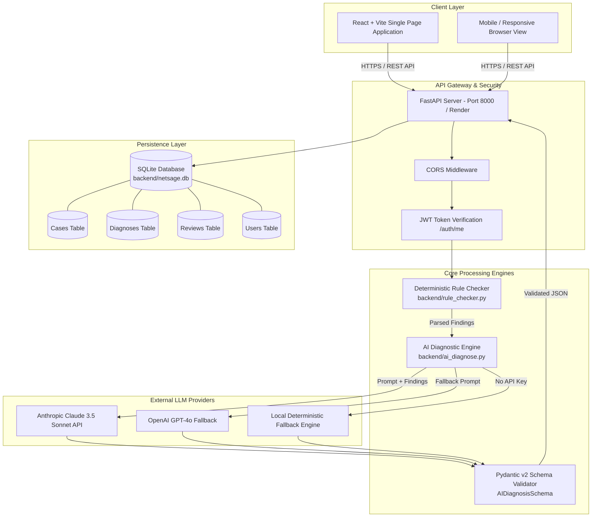
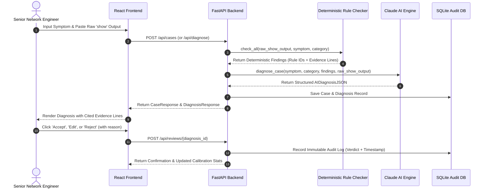
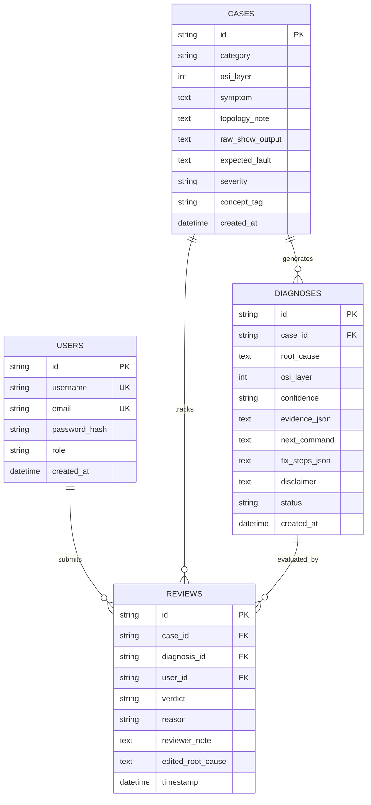

# NetSage AI — System Architecture & Data Flow Specification

---

## 1. High-Level Component Architecture

---

## 2. Sequence Diagram: Case Intake to Review

---

## 3. Database Entity Relationship Diagram (ERD)

---

## 4. Security & Authentication Architecture

- **Password Hashing**: Uses `passlib` with `bcrypt` rounds to ensure credential security.
- **JWT Tokens**: Signed using HMAC-SHA256 secret keys (`JWT_SECRET_KEY`) with 24-hour expiration (`ACCESS_TOKEN_EXPIRE_MINUTES = 1440`).
- **CORS Policies**: Explicit middleware allowing safe HTTP headers and cross-origin requests for deployed frontends.
- **API Guardrails**: Unauthenticated users can submit cases and evaluate diagnoses; authenticated sessions attach engineer user IDs to reviews for audit compliance.
