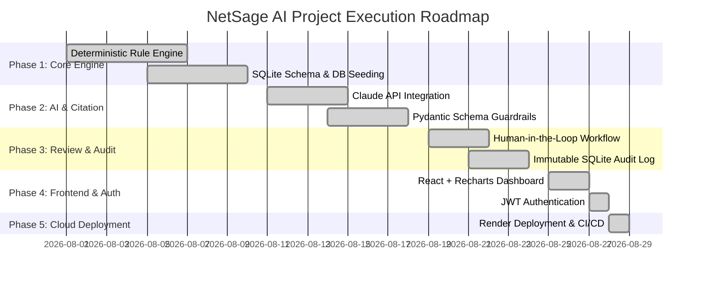

# NetSage AI — Strategic Project Plan & Roadmap

---

## 1. Project Vision & Goals

**NetSage AI** delivers an evidence-grounded AI troubleshooting workflow tailored for Cisco Packet Tracer labs and enterprise network operations. 

### Core Objectives
1. **Reduce Mean Time to Resolution (MTTR)** for network engineers troubleshooting multi-layer Cisco issues.
2. **Eliminate AI Hallucination** through deterministic pre-parsing of Cisco CLI output (`show ip interface brief`, `show vlan brief`, `show ip route`, `show ip dhcp pool`, etc.).
3. **Enforce Absolute Human Authority**: AI produces recommendations only; human engineers retain 100% execution authority.
4. **Maintain Auditable Model Calibration**: Provide dynamic charts tracking model precision vs confidence to meet Responsible AI standards.

---

## 2. 5-Phase Architectural Roadmap

### Phase Details

#### Phase 1: Deterministic Foundation & DB Seeding (Completed)
- Built pure Python regex rule parser (`RuleChecker`) covering interface status, VLAN/Trunking, Routing, DHCP, ACL, NAT, Wireless/DNS.
- Designed SQLite database schema (`CaseModel`, `DiagnosisModel`, `ReviewModel`, `UserModel`).
- Created seed script (`scripts/seed_db.py`) populated with 32 realistic Cisco Packet Tracer failure scenarios.

#### Phase 2: AI Engine & Line-Citation Guardrails (Completed)
- Integrated Anthropic Claude API (`claude-3-5-sonnet-20241022`) and OpenAI fallback.
- Implemented `AIDiagnosisSchema` using Pydantic v2 to enforce strict JSON structure.
- Developed automatic retry logic on schema invalidity and zero-dependency fallback engine.

#### Phase 3: Human-in-the-Loop Review & Audit Log (Completed)
- Designed 3-stage verdict workflow (`Accepted`, `Edited`, `Rejected`).
- Implemented mandatory failure reason codes (`wrong_root_cause`, `wrong_evidence`, `low_confidence_justified`, `other`).
- Added support for engineer-edited root causes to continuously capture human corrections.

#### Phase 4: Frontend Dashboard & JWT Security (Completed)
- Built React 18 frontend with Tailwind CSS and Recharts visualizations.
- Integrated JWT authentication (`/api/auth/register`, `/api/auth/login`, `/api/auth/me`).
- Developed real-time Responsible AI Calibration curve charting model confidence vs acceptance rate.

#### Phase 5: Production Cloud Deployment (Completed)
- Configured Render cloud service deployment (`render.yaml`, `build.sh`).
- Published live web application at: [https://netsage-ai-eost.onrender.com](https://netsage-ai-eost.onrender.com)
- Verified end-to-end API health and test suite execution (15/15 passing tests).

---

## 3. Future Roadmap & Enhancement Pipeline

| Enhancement | Target Quarter | Description | Priority |
| :--- | :--- | :--- | :--- |
| **Cisco Packet Tracer API / CLI Agent** | Q4 2026 | Direct connection to Cisco Packet Tracer CLI or SSH session for real-time `show` command execution. | High |
| **Multi-Tenant RBAC** | Q4 2026 | Enterprise Role-Based Access Control (Junior Engineer, Senior Reviewer, Audit Admin). | Medium |
| **LLM Fine-Tuning Pipeline** | Q1 2027 | Automated dataset export of `Edited` and `Rejected` reviews to fine-tune open-weight models (Llama 3 / Mistral). | High |
| **Enterprise SSO Integration** | Q1 2027 | OAuth2 / SAML / OIDC integration for corporate network operation centers (NOC). | Low |
