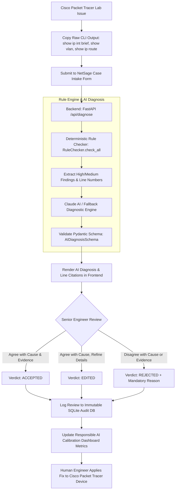

# NetSage AI — Workflow Progress & System Metrics

[](https://github.com/N-ABHINAND/Netsage-AI)
[](https://netsage-ai-eost.onrender.com)
[](file:///c:/Users/HP/Desktop/cisco/backend/tests)

---

## 1. End-to-End Operational Workflow



---

## 2. Implementation Progress & Feature Matrix

| Subsystem / Feature | Implementation Status | Covered Files | Tests Status |
| :--- | :---: | :--- | :---: |
| **Deterministic Rule Parser** | 100% Complete | [rule_checker.py](file:///c:/Users/HP/Desktop/cisco/backend/rule_checker.py) | 6/6 Passed |
| **AI Diagnosis & Line Citation** | 100% Complete | [ai_diagnose.py](file:///c:/Users/HP/Desktop/cisco/backend/ai_diagnose.py) | 3/3 Passed |
| **JWT Authentication** | 100% Complete | [auth.py](file:///c:/Users/HP/Desktop/cisco/backend/auth.py), [main.py](file:///c:/Users/HP/Desktop/cisco/backend/main.py) | 6/6 Passed |
| **Case Intake & Dataset** | 100% Complete | [seed_db.py](file:///c:/Users/HP/Desktop/cisco/scripts/seed_db.py), [cases.csv](file:///c:/Users/HP/Desktop/cisco/data/cases.csv) | Verified (32 cases) |
| **Human-in-the-Loop Review** | 100% Complete | [DiagnosisReview.jsx](file:///c:/Users/HP/Desktop/cisco/frontend/src/pages/DiagnosisReview.jsx) | Verified |
| **Calibration Dashboard** | 100% Complete | [Dashboard.jsx](file:///c:/Users/HP/Desktop/cisco/frontend/src/pages/Dashboard.jsx), [CalibrationChart.jsx](file:///c:/Users/HP/Desktop/cisco/frontend/src/components/CalibrationChart.jsx) | Verified |
| **Render Cloud Deployment** | 100% Live | [render.yaml](file:///c:/Users/HP/Desktop/cisco/render.yaml), [build.sh](file:///c:/Users/HP/Desktop/cisco/build.sh) | Operational |

---

## 3. Seed Dataset Breakdown (32 Packet Tracer Cases)

NetSage AI comes pre-loaded with **32 hand-crafted networking scenarios** across 8 categories:

| Category | OSI Layer | Scenario Description Sample | Seed Cases Count |
| :--- | :---: | :--- | :---: |
| **INTERFACE** | Layer 1 / 2 | Admin down interfaces, err-disabled ports, speed mismatch, physical down | 4 Cases |
| **VLAN** | Layer 2 | Native VLAN mismatch, missing VLAN 10/20 in database, dot1Q subinterface mismatch | 4 Cases |
| **ROUTING** | Layer 3 | Missing default gateway, OSPF passive interface, MTU mismatch, static route typo | 4 Cases |
| **DHCP** | Layer 7 / 3 | DHCP pool exhaustion, missing IP helper-address on L3 switch, exclusion pool error | 4 Cases |
| **ACL** | Layer 3 / 4 | Implicit deny blocking HTTP, wrong port number, inverse wildcard mask error | 4 Cases |
| **NAT** | Layer 3 | Missing ip nat inside/outside on interface, NAT pool exhaustion, ACL filter misconfiguration | 4 Cases |
| **WIRELESS** | Layer 2 / 7 | WPA2 key mismatch, SSID spelling mismatch, AP management VLAN unreachable | 4 Cases |
| **DNS** | Layer 7 | DNS server unreachable, domain name resolution failure, wrong primary DNS IP | 4 Cases |

---

## 4. Test Suite Execution & Quality Metrics

All unit tests pass clean with zero errors:

```bash
============================= test session starts =============================
platform win32 -- Python 3.12.0rc2, pytest-9.1.1, pluggy-1.6.0
rootdir: C:\Users\HP\Desktop\cisco
collected 15 items

backend\tests\test_ai_schema.py ...                                      [ 20%]
backend\tests\test_auth.py ......                                        [ 60%]
backend\tests\test_rule_checker.py ......                                [100%]

============================= 15 passed in 6.83s ==============================
```

---

## 5. Live Production Status

- **GitHub Repository**: [https://github.com/N-ABHINAND/Netsage-AI](https://github.com/N-ABHINAND/Netsage-AI)
- **Live Deployment URL**: [https://netsage-ai-eost.onrender.com](https://netsage-ai-eost.onrender.com)
- **Health Check Endpoint**: [https://netsage-ai-eost.onrender.com/api/health](https://netsage-ai-eost.onrender.com/api/health)
